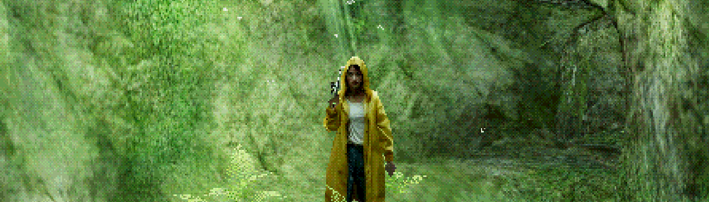
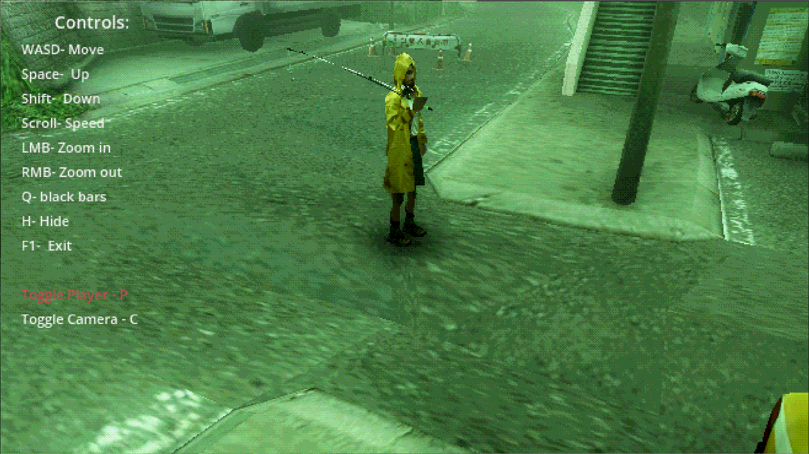
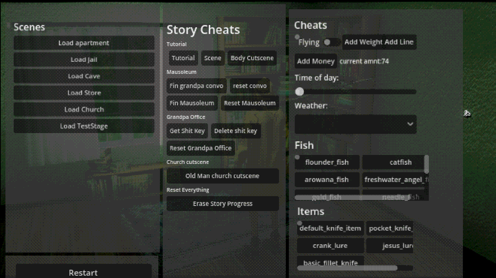

Short Description
Unlocks the game's built-in debug menu. Applies a small script extension to the pause menu so it stops resetting the debug flag every frame. No files in the base game are modified.

Fill Description
# RougeShadow-DebugUnlocker

[Nexus Mods page](https://www.nexusmods.com/mods/2?game_id=9610) (pending approval, publishes once the game
itself is approved on Nexus).

Unlocks the debug menu the developer already built into About Fishing but left disabled. This mod doesn't add
anything new, it just flips it back on.

## Installation

1. Requires [Godot Mod Loader](https://github.com/GodotModding/godot-mod-loader) to be installed first (see
   [RougeShadow-ModLoaderConfig](https://github.com/Dsiman/RougeShadow-ModLoaderConfig)).
2. Place the `.zip` release inside `AboutFishing/mods/` (create the folder next to the exe if it doesn't exist).

## How it works

A [Script Extension](https://wiki.godotmodding.com/guides/modding/script_extensions/) on
`autoloads/pausemenu/pause_menu_code.gd` overrides `_input()` with the full original function body, minus one
line: `debug_build_for_testing = false`. That line was resetting the debug flag every single frame, which is
why the menu was permanently disabled in the shipped build.

Note: ModLoader's Script Extensions can't insert code into the middle of a function, so this had to copy the
entire original `_input()` (roughly 25 lines, handling caps-lock pause, F1 toggle, and the actual pause menu
open/close logic) rather than patching just the one line. If the game updates and this function changes, this
extension will need to be re-synced by hand.

## Usage

Press F1:
- While in-game: opens camera and cinematic controls.
- While paused: opens teleport, item & fish spawning, and story/save controls.

When spawning an item, close the debug menu and open your inventory to place the obtained item.

## Known Issues

- Loading a new scene from some locations sometimes triggers an unrecoverable error. Workaround: always load
  scenes from outside a "Building" scene.
- Talking to "Nathan" in the test scene causes an unrecoverable null reference error. His dialogue was reused
  from Joshua, and the camera referenced by that dialogue has since been renamed.

## Requirements

- [Godot Mod Loader](https://github.com/GodotModding/godot-mod-loader)
- [RougeShadow-ModLoaderConfig](https://github.com/Dsiman/RougeShadow-ModLoaderConfig) to get ModLoader actually working on this
  specific compiled game (or generate the equivalent files yourself, see that mod's README for details).

## Credits

Thanks to the developer(s) and everyone involved in making About Fishing.
